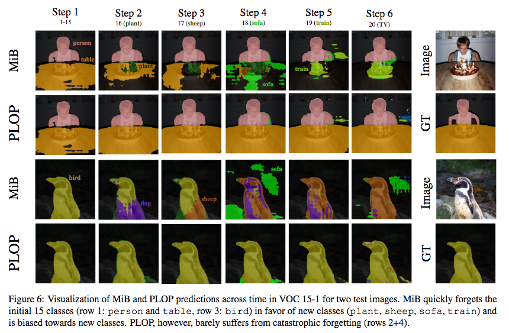

<div align="center">

# PLOP: Learning without Forgetting for Continual Semantic Segmentation

[](https://arxiv.org/abs/2011.11390)
[](https://arxiv.org/abs/2011.11390)

</div>





This repository contains all of our code. It is a modified version of
[Cermelli et al.'s repository](https://github.com/fcdl94/MiB).


```
@inproceedings{douillard2021plop,
  title={PLOP: Learning without Forgetting for Continual Semantic Segmentation},
  authors={Douillard, Arthur and Chen, Yifu and Dapogny, Arnaud and Cord, Matthieu},
  booktitle={Proceedings of the IEEE Conference on Computer Vision and Pattern Recognition (CVPR)},
  year={2021}
}
```

# Requirements

You need to install the following libraries:
- Python (3.6)
- Pytorch (1.8.1+cu102)
- torchvision (0.9.1+cu102)
- tensorboardX (1.8)
- apex (0.1)
- matplotlib (3.3.1)
- numpy (1.17.2)
- [inplace-abn](https://github.com/mapillary/inplace_abn) (1.0.7)

Note also that apex seems to only work with some CUDA versions, therefore try to install Pytorch with
the 10.2 CUDA versions, do:

```
conda install -y pytorch torchvision cudatoolkit=10.2 -c pytorch
cd apex
pip3 install -v --no-cache-dir --global-option="--cpp_ext" --global-option="--cuda_ext" ./
```

# Dataset

Two scripts are available to download ADE20k and Pascal-VOC 2012, please see in the `data` folder.
For Cityscapes, you need to do it yourself, because you have to ask "permission" to the holders; but be
reassured, it's only a formality, you can get the link in a few days by mail.


# How to perform training
The most important file is run.py, that is in charge to start the training or test procedure.
To run it, simpy use the following command:

> python -m torch.distributed.launch --nproc_per_node=\<num_GPUs\> run.py --data_root \<data_folder\> --name \<exp_name\> .. other args ..

The default is to use a pretraining for the backbone used, that is searched in the pretrained folder of the project.
We used the pretrained model released by the authors of In-place ABN (as said in the paper), that can be found here:
 [link](https://github.com/mapillary/inplace_abn#training-on-imagenet-1k). I've also upload those weights there: [link](https://github.com/arthurdouillard/CVPR2021_PLOP/releases/download/v1.0/resnet101_iabn_sync.pth.tar).

Since the pretrained are made on multiple-gpus, they contain a prefix "module." in each key of the network. Please, be sure to remove them to be compatible with this code (simply rename them using key = key\[7:\]) (if you're working on single gpu).
If you don't want to use pretrained, please use --no-pretrained.

There are many options (you can see them all by using --help option), but we arranged the code to being straightforward to test the reported methods.
Leaving all the default parameters, you can replicate the experiments by setting the following options.
- please specify the data folder using: --data_root \<data_root\>
- dataset: --dataset voc (Pascal-VOC 2012) | ade (ADE20K)
- task: --task \<task\>, where tasks are
    - 15-5, 15-5s, 19-1 (VOC), 100-50, 100-10, 50, 100-50b, 100-10b, 50b (ADE, b indicates the order)
- step (each step is run separately): --step \<N\>, where N is the step number, starting from 0
- (only for Pascal-VOC) disjoint is default setup, to enable overlapped: --overlapped
- learning rate: --lr 0.01 (for step 0) | 0.001 (for step > 0)
- batch size: --batch_size \<24/num_GPUs\>
- epochs: --epochs 30 (Pascal-VOC 2012) | 60 (ADE20K)
- method: --method \<method name\>, where names are
    - FT, LWF, LWF-MC, ILT, EWC, RW, PI, MIB

For all details please follow the information provided using the help option.

#### Example commands

LwF on the 100-50 setting of ADE20K, step 0:
> python -m torch.distributed.launch --nproc_per_node=2 run.py --data_root data --batch_size 12 --dataset ade --name LWF --task 100-50 --step 0 --lr 0.01 --epochs 60 --method LWF

MIB on the 50b setting of ADE20K, step 2:
> python -m torch.distributed.launch --nproc_per_node=2 run.py --data_root data --batch_size 12 --dataset ade --name MIB --task 100-50 --step 2 --lr 0.001 --epochs 60 --method MIB

LWF-MC on 15-5 disjoint setting of VOC, step 1:
> python -m torch.distributed.launch --nproc_per_node=2 run.py --data_root data --batch_size 12 --dataset voc --name LWF-MC --task 15-5 --step 1 --lr 0.001 --epochs 30 --method LWF-MC

PLOP on 15-1 overlapped setting of VOC, step 1:
> python -m torch.distributed.launch --nproc_per_node=2 run.py --data_root data --batch_size 12 --dataset voc --name PLOP --task 15-5s --overlapped --step 1 --lr 0.001 --epochs 30 --method FT --pod local --pod_factor 0.01 --pod_logits --pseudo entropy --threshold 0.001 --classif_adaptive_factor --init_balanced --pod_options "{\"switch\": {\"after\": {\"extra_channels\": \"sum\", \"factor\": 0.0005, \"type\": \"local\"}}}"


Once you trained the model, you can see the result on tensorboard (we perform the test after the whole training)
 or you can test it by using the same script and parameters but using the command
> --test

that will skip all the training procedure and test the model on test data.

Or more simply you can use one of the provided script that will launch every step of a continual training.

For example, do

````
bash scripts/plop_15-1.sh
````

Note that you will need to modify those scripts to include the path where your data.
